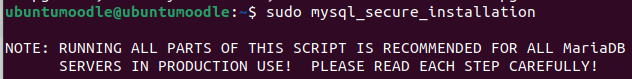
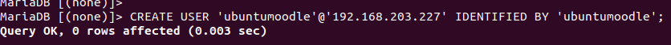

# Crear Moodle 

Ho hem de fer desde una màquina virtual d'ubutu server.
Per poder treballar amb la màquina més còmode i per evitar problemes fem la seguent comanda aixi treballarem desde la terminal de la màquina real.

```sh
ssh nom@IP
```
Ara ens hem d'instal·lar el moodle 


Ara ens instal·lem el Apache2.
```sh
sudo apt-get install apache2
```


Un cop tinguem el apache hem d'instal·lar MariaDB.
```sh
sudo apt-get install mariadb-server
```


Quan s'ens hagui instal·lat hem de configurar MariaDB.



Finalment ens instal·lem una versio de PHP compatible amb el moodle.
```sh
sudo aptitude install php7.3 php7.3-mysql php7.3-intl php7.3-curl php7.3-xml php7.3-gd
```


Hem de canviar el fixer dir.conf per donar prioritat al php amb la comanda:
```sh
sudo nano /etc/apache2/mods-enabled/dir.conf
```
Ha de quedar així.


Ara el descomprimim el .zip del moodle que ens hem intal·lar al principi. L'hem d'extrèure al directori /var/www/html per fer-lo accessible via web.

```sh
sudo unzip moodle-4.0.5.zip -d /var/www/html/
```


Hem de canviar les propietat per a que pugui ser escrit pel servidor web.
```sh
sudo chown www-data:www-data /var/www/html/moodle
```

Ara hem de crear un directori de fitxers per a que moodle pugui guardar els seus fitxers, el nom que li he ficat al directori és moodle_data.


Per ùltim falta configurar la base de dades.

Primer hem d'accedir a la base de dades amb:
```sh
mysql -u root -p
```
Un cop dintre hem de crear un usuari per al moodle
```sh 
CREATE USER 'ubuntumoodle'@'192.168.203.227' IDENTIFIED BY 'ubuntumoodle';
```



