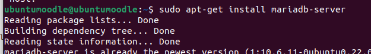

# Crear Moodle 

Ho hem de fer desde una màquina virtual d'ubutu server.
Per poder treballar amb la màquina més còmode i per evitar problemes fem la seguent comanda aixi treballarem desde la terminal de la màquina real.

```sh
ssh nom@IP
```
Ara ens hem d'instal·lar el moodle 


Ara ens instal·lem el Apache2.
```sh
sudo apt-get install apache2
```


Un cop tinguem el apache hem d'instal·lar MariaDB.
```sh
sudo apt-get install mariadb-server
```


Quan s'ens hagui instal·lat hem de configurar MariaDB.


Finalment ens intal·lem una versio de PHP compatible amb el moodle.
```sh
sudo aptitude install php7.3 php7.3-mysql php7.3-intl php7.3-curl php7.3-xml php7.3-gd
```


Ara el descomprimim el .zip del moodle que ens hem intal·lar al principi. L'hem d'extrèure al directori /var/www/html per fer-lo accessible via web.

```sh
sudo unzip moodle-4.0.5.zip -d /var/www/html/
```

