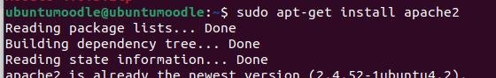

# Crear Moodle 

Ho hem de fer desde una màquina virtual d'ubutu server.
Per poder treballar amb la màquina més còmode i per evitar problemes fem la seguent comanda aixi treballarem desde la terminal de la màquina real.

```sh
ssh nom@IP
```
Ara ens hem d'instal·lar el moodle 


Ara ens instal·lem el Apache2.
```sh
sudo apt-get install apache2
```


Un cop tinguem el apache hem d'instal·lar MariaDB.
```sh
sudo apt-get install mariadb-server
```


Quan s'ens hagui instal·lat hem de configurar MariaDB.


Ara el descomprimim al directori /var/www/html per fer-lo accessible via web.

```sh
sudo unzip moodle-latest-38.zip -d /var/www/html/
```

