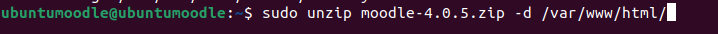

# INSTAL·LACIÓ I CONFIGURACIÓ MOODLE


### INSTAL·LACIÓ

Ho hem de fer desde una màquina virtual d'ubutu server.
Per poder treballar amb la màquina més còmode i per evitar problemes fem la seguent comanda aixi treballarem desde la terminal de la màquina real.

```sh
ssh nom@IP
```
Ara ens hem d'instal·lar el moodle 


Ara ens instal·lem el Apache2.
```sh
sudo apt-get install apache2
```


Un cop tinguem el apache hem d'instal·lar MariaDB.
```sh
sudo apt-get install mariadb-server
```


Quan s'ens hagui instal·lat hem de configurar MariaDB.


Finalment ens instal·lem una versio de PHP compatible amb el moodle.
```sh
sudo aptitude install php7.3 php7.3-mysql php7.3-intl php7.3-curl php7.3-xml php7.3-gd
```


Hem de canviar el fixer dir.conf per donar prioritat al php amb la comanda:
```sh
sudo nano /etc/apache2/mods-enabled/dir.conf
```
Ha de quedar així.


Ara el descomprimim el .zip del moodle que ens hem intal·lar al principi. L'hem d'extrèure al directori /var/www/html per fer-lo accessible via web.

```sh
sudo unzip moodle-4.0.5.zip -d /var/www/html/
```



Hem de canviar les propietat per a que pugui ser escrit pel servidor web.

```sh
sudo chown www-data:www-data /var/www/html/moodle
```

Ara hem de crear un directori de fitxers per a que moodle pugui guardar els seus fitxers, el nom que li he ficat al directori és moodle_data.


Configurar base de dades per a Moodle

Primer hem d'accedir a la base de dades amb:

```sh
mysql -u root -p
```

Un cop dintre hem de crear un usuari per al moodle

```sh 
CREATE USER 'ubuntumoodle'@'localhost' IDENTIFIED BY 'ubuntumoodle';
```


Ara hem de crear una base de dades per al Moodle amb:

```sh
CREATE DATABASE moodle;
```


Finalment donem permisos amb:
```sh
GRANT ALL PRIVILEGES ON moodle.* TO 'ubuntumoodle'@'localhost';
FLUSH PRIVILEGES;
```


Si ho hem fet tot bé ens hauria de sortir així quan fiquem la ip/moodle al buscador.


### CONFIGURACIÓ

Un cop dintre el primer que hem de fer és seleccionar d'idioma d'intal·lació.


Ens dirá que falla el modul zip del PHP.


Entrem a la terminal i dinte de la carpeta del moodle busquem al PHP el paquet zip amb la comanda:
```sh
sudo apt search php | grep zip
```

Ens mostra tots els paquets que estàn disponibles.


Ara instal·lem el php-zip 


Un cop instal·lat fem un reload i ja ens anirà.


Ara ens preguntara on volem guardar les dades, en aquest cas fiquem que es guarden a /home/moodle_data que l'hem creat antes.


Ens preguntá quin controlador de base de dades utilitzem, en aquest cas es Maria DB però si no estem segurs podem saber-ho ficant la seguent comanda a la terminal:
```sh
sudo mysql -v
```


En aquesta pàgina hem de ficar els caps que ens demanen.


Ara ens sortirà un error dient-mos que ens falta l'extensió mbstring de PHP.


Anem a la terminal i buquem el que ens hem d'instal·lar.


busquem el paquet que ens volem instal·lar segons la versió de php i l'intal·lem.
```sh
sudo apt search php | grep mbstring
```

```sh
sudo apt install php7.3-mbstring
```


Fem un reload i ja ens hauia de sortir.
```sh
sudo service apache2 reload
```


Fiquem que acceptem els "terminos y condiciones" i ens farà unes comprovacións automàtiques. 
en aquest cas ens ha marcat revisar dos extencions que no tenim instal·lades aixì que les instal·lem les dos i fem un reload del servei.


```sh
sudo apt search php | grep xmlrpc
```
```sh
sudo apt install php7.3-xmlrpc
```


```sh
sudo apt search php | grep soap
```
```sh
sudo apt install php7.3-soap
```


Ara fem un reload i ja estaria.


Quan hagui fet totes les comprovacións necessàries ens sortirà aquesta pantalla on hem de posar l'informació general del administrador.


Ho emplenem i fiquem update profile.


### CREACIÓ DE CURSOS

Pimer hem de crear categoies i subcategories, per fer això hem de modificar la categorìa que ve per defecte i ficar el nom que volem.


Un cop tenim la categoria que tenim podem crear subcategories dintre s'aquesta i dintre de les subgategories també podem crear subcategories.


La pantalla que ens sortirà és igual que la de modificar la categorìa.
Fem tantes subcategorìes com vulguem, en aquest cas ha quedat aixì.


Un cop creades les subcategorìes ja podem crear els cursos que volem, en aquest cas he creat 3 cursos dintre de CFGM SMX/2n curs i 4 cursos dintre de la subcategorìa  CFGM SMX/2n curs/ Grup B.
Per crear els cursos simplement hem de entrar dintre de la subcategoria i fem clic a add new course, ens sortirà aquesta pantalla on fiquem les dades ue volem.


Fem això tantes vegades com necessitem dintre de les subcategories que vulguem.
Aqui és poden veure els cursos creats dintre de les categories pertinents.


### TIPUS D'USUARIS

1.Quins tipus d'usuaris (rols diferents) existeixen a Moodle?
  Ordinaris, professors, creadors, administradors.
2.Quins rols poden assignar cada tipus d'usuaris?
  
3.Crea tres usuaris:
  ·Un Professor anomenat Cognom_1_profe.
  ·Un Professor anomenat Cognom_2_profe.
  ·Un professor No editor anomenat Cognom_3_profe.

