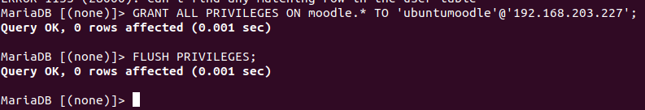

# INSTAL·LACIÓ I CONFIGURACIÓ MOODLE


### INSTAL·LACIÓ

Ho hem de fer desde una màquina virtual d'ubutu server.
Per poder treballar amb la màquina més còmode i per evitar problemes fem la seguent comanda aixi treballarem desde la terminal de la màquina real.

```sh
ssh nom@IP
```
Ara ens hem d'instal·lar el moodle 


Ara ens instal·lem el Apache2.
```sh
sudo apt-get install apache2
```


Un cop tinguem el apache hem d'instal·lar MariaDB.
```sh
sudo apt-get install mariadb-server
```


Quan s'ens hagui instal·lat hem de configurar MariaDB.


Finalment ens instal·lem una versio de PHP compatible amb el moodle.
```sh
sudo aptitude install php7.3 php7.3-mysql php7.3-intl php7.3-curl php7.3-xml php7.3-gd
```


Hem de canviar el fixer dir.conf per donar prioritat al php amb la comanda:
```sh
sudo nano /etc/apache2/mods-enabled/dir.conf
```
Ha de quedar així.


Ara el descomprimim el .zip del moodle que ens hem intal·lar al principi. L'hem d'extrèure al directori /var/www/html per fer-lo accessible via web.

```sh
sudo unzip moodle-4.0.5.zip -d /var/www/html/
```


Hem de canviar les propietat per a que pugui ser escrit pel servidor web.

```sh
sudo chown www-data:www-data /var/www/html/moodle
```

Ara hem de crear un directori de fitxers per a que moodle pugui guardar els seus fitxers, el nom que li he ficat al directori és moodle_data.


Configurar base de dades per a Moodle

Primer hem d'accedir a la base de dades amb:

```sh
mysql -u root -p
```

Un cop dintre hem de crear un usuari per al moodle

```sh 
CREATE USER 'ubuntumoodle'@'192.168.203.227' IDENTIFIED BY 'ubuntumoodle';
```


Ara hem de crear una base de dades per al Moodle amb:

```sh
CREATE DATABASE moodle;
```


Finalment donem permisos amb:
```sh
GRANT ALL PRIVILEGES ON moodle.* TO 'ubuntumoodle'@'192.168.203.227';
FLUSH PRIVILEGES;
```



Si ho hem fet tot bé ens hauria de sortir així quan fiquem la ip/moodle al buscador.


### CONFIGURACIÓ

Un cop dintre el primer que hem de fer és seleccionar d'idioma d'intal·lació.


Ens dirá que falla el modul zip del PHP.


Entrem a la terminal i dinte de la carpeta del moodle busquem al PHP el paquet zip amb la comanda:
```sh
sudo apt search php | grep zip
```

Ens mostra tots els paquets que estàn disponibles.


Ara intal·lem el php-zip 


Un cop instal·lat fem un reload i ja ens anirà.


